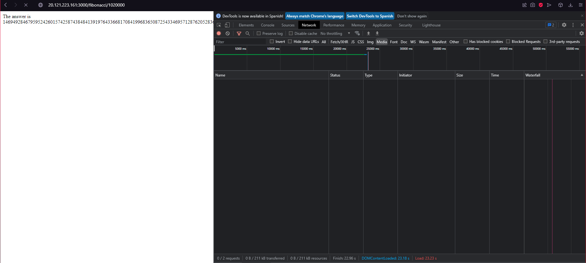
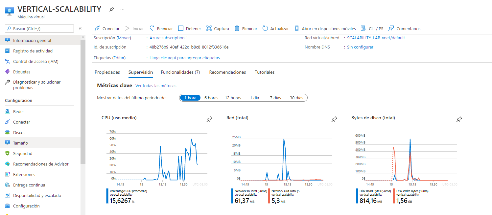
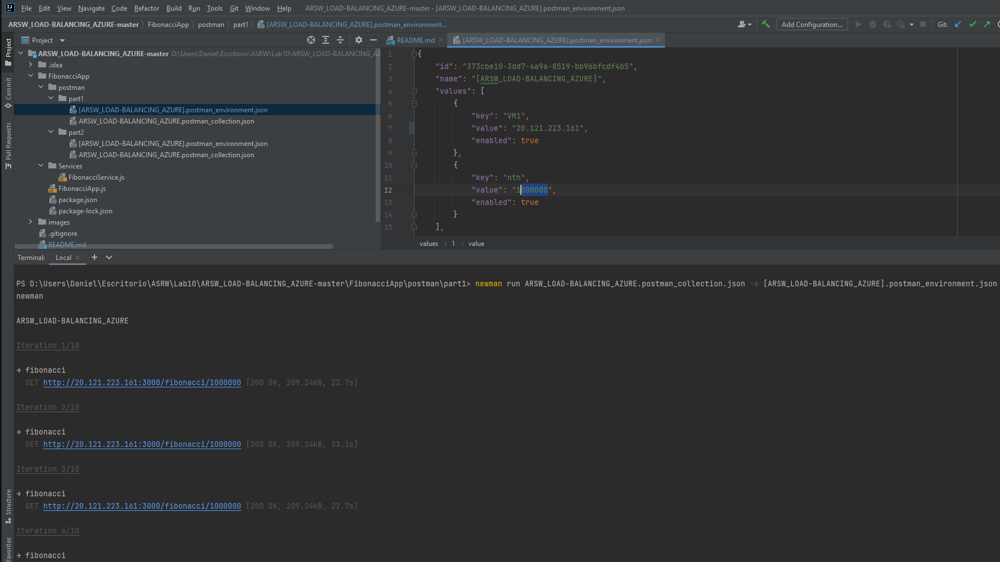
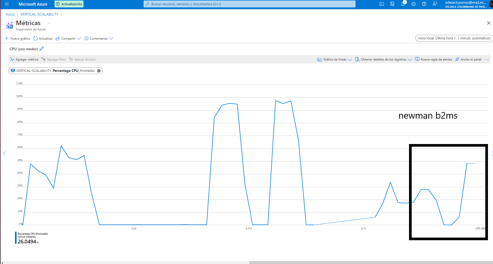

### Escuela Colombiana de Ingeniería
### Arquitecturas de Software - ARSW

## Escalamiento en Azure con Maquinas Virtuales, Sacale Sets y Service Plans

### Dependencias
* Cree una cuenta gratuita dentro de Azure. Para hacerlo puede guiarse de esta [documentación](https://azure.microsoft.com/en-us/free/search/?&ef_id=Cj0KCQiA2ITuBRDkARIsAMK9Q7MuvuTqIfK15LWfaM7bLL_QsBbC5XhJJezUbcfx-qAnfPjH568chTMaAkAsEALw_wcB:G:s&OCID=AID2000068_SEM_alOkB9ZE&MarinID=alOkB9ZE_368060503322_%2Bazure_b_c__79187603991_kwd-23159435208&lnkd=Google_Azure_Brand&dclid=CjgKEAiA2ITuBRDchty8lqPlzS4SJAC3x4k1mAxU7XNhWdOSESfffUnMNjLWcAIuikQnj3C4U8xRG_D_BwE). Al hacerlo usted contará con $200 USD para gastar durante 1 mes.

### Parte 0 - Entendiendo el escenario de calidad

Adjunto a este laboratorio usted podrá encontrar una aplicación totalmente desarrollada que tiene como objetivo calcular el enésimo valor de la secuencia de Fibonnaci.

**Escalabilidad**
Cuando un conjunto de usuarios consulta un enésimo número (superior a 1000000) de la secuencia de Fibonacci de forma concurrente y el sistema se encuentra bajo condiciones normales de operación, todas las peticiones deben ser respondidas y el consumo de CPU del sistema no puede superar el 70%.

### Parte 1 - Escalabilidad vertical

1. Diríjase a el [Portal de Azure](https://portal.azure.com/) y a continuación cree una maquina virtual con las características básicas descritas en la imágen 1 y que corresponden a las siguientes:
    * Resource Group = SCALABILITY_LAB
    * Virtual machine name = VERTICAL-SCALABILITY
    * Image = Ubuntu Server 
    * Size = Standard B1ls
    * Username = scalability_lab
    * SSH publi key = Su llave ssh publica


2. Para conectarse a la VM use el siguiente comando, donde las `x` las debe remplazar por la IP de su propia VM.

    `ssh scalability_lab@xxx.xxx.xxx.xxx`

3. Instale node, para ello siga la sección *Installing Node.js and npm using NVM* que encontrará en este [enlace](https://linuxize.com/post/how-to-install-node-js-on-ubuntu-18.04/).
4. Para instalar la aplicación adjunta al Laboratorio, suba la carpeta `FibonacciApp` a un repositorio al cual tenga acceso y ejecute estos comandos dentro de la VM:

    `git clone <your_repo>`

    `cd <your_repo>/FibonacciApp`

    `npm install`

5. Para ejecutar la aplicación puede usar el comando `npm FibinacciApp.js`, sin embargo una vez pierda la conexión ssh la aplicación dejará de funcionar. Para evitar ese compartamiento usaremos *forever*. Ejecute los siguientes comando dentro de la VM.

    `npm install forever -g`

    `forever start FibinacciApp.js`

6. Antes de verificar si el endpoint funciona, en Azure vaya a la sección de *Networking* y cree una *Inbound port rule* tal como se muestra en la imágen. Para verificar que la aplicación funciona, use un browser y user el endpoint `http://xxx.xxx.xxx.xxx:3000/fibonacci/6`. La respuesta debe ser `The answer is 8`.


7. La función que calcula en enésimo número de la secuencia de Fibonacci está muy mal construido y consume bastante CPU para obtener la respuesta. Usando la consola del Browser documente los tiempos de respuesta para dicho endpoint usando los siguintes valores:
   
<<<<<<< HEAD
    * 1000000 
    * 1010000
    * 1020000
    * 1030000
    * 1040000
    * 1050000
    * 1060000
    * 1070000
    * 1080000
    * 1090000    
=======
    * 1000000 22.81 segundos en ejecución
    * 1010000 23.23 segundos en ejecución
    * 1020000 23.86 segundos en ejecución
    * 1030000 24.28 segundos en ejecución
    * 1040000 24.42 segundos en ejecución
    * 1050000 24.60 segundos en ejecución
    * 1060000 25.65 segundos en ejecución
    * 1070000 27.49 segundos en ejecución
    * 1080000 27.54 segundos en ejecución
    * 1090000 27.55 segundos en ejecución
    
    Tiempos con `B2ms`
    
    * 1000000 20.05 segundos en ejecución
    * 1010000 20.28 segundos en ejecución
    * 1020000 21.26 segundos en ejecución
    * 1030000 21.25 segundos en ejecución
    * 1040000 22.03 segundos en ejecución
    * 1050000 22.41 segundos en ejecución
    * 1060000 22.25 segundos en ejecución
    * 1070000 22.71 segundos en ejecución
    * 1080000 23.92 segundos en ejecución
    * 1090000 23.85 segundos en ejecución
>>>>>>> e744e6877ea74020a35487eaad8d952528fd1b31

8. Dírijase ahora a Azure y verifique el consumo de CPU para la VM. (Los resultados pueden tardar 5 minutos en aparecer).




`B2ms`


9. Ahora usaremos Postman para simular una carga concurrente a nuestro sistema. Siga estos pasos.
    * Instale newman con el comando `npm install newman -g`. Para conocer más de Newman consulte el siguiente [enlace](https://learning.getpostman.com/docs/postman/collection-runs/command-line-integration-with-newman/).
    * Diríjase hasta la ruta `FibonacciApp/postman` en una maquina diferente a la VM.
    * Para el archivo `[ARSW_LOAD-BALANCING_AZURE].postman_environment.json` cambie el valor del parámetro `VM1` para que coincida con la IP de su VM.
    * Ejecute el siguiente comando.

    ```
    newman run ARSW_LOAD-BALANCING_AZURE.postman_collection.json -e [ARSW_LOAD-BALANCING_AZURE].postman_environment.json -n 10 &
    newman run ARSW_LOAD-BALANCING_AZURE.postman_collection.json -e [ARSW_LOAD-BALANCING_AZURE].postman_environment.json -n 10
    ```
   
   
   

   `B2ms`
   
<<<<<<< HEAD

   
   
=======
>>>>>>> e744e6877ea74020a35487eaad8d952528fd1b31

11. La cantidad de CPU consumida es bastante grande y un conjunto considerable de peticiones concurrentes pueden hacer fallar nuestro servicio. Para solucionarlo usaremos una estrategia de Escalamiento Vertical. En Azure diríjase a la sección *size* y a continuación seleccione el tamaño `B2ms`.


11. Una vez el cambio se vea reflejado, repita el paso 7, 8 y 9.
12. Evalue el escenario de calidad asociado al requerimiento no funcional de escalabilidad y concluya si usando este modelo de escalabilidad logramos cumplirlo.

Observando los resultados mostrados con `B1ls` y comparándolos con `B2ms` podemos ver que efectivamente los resultados son bastante notorios, ya que el consumo de un 90 a 100 % se vieron reducidos a un consumo de tan solo
un 30 a 45 % de uso de la máquina.

<<<<<<< HEAD
13. Vuelva a dejar la VM en el tamaño inicial para evitar cobros adicionales.
=======
14. Vuelva a dejar la VM en el tamaño inicial para evitar cobros adicionales.
>>>>>>> e744e6877ea74020a35487eaad8d952528fd1b31

**Preguntas**

1. ¿Cuántos y cuáles recursos crea Azure junto con la VM?

* Memoria
* red
* procesamiento (cpu)
* almacenamiento

2. ¿Brevemente describa para qué sirve cada recurso?

* Memoria : memoria volatil.
* red : conexion de a diferentes redes de internet.
* procesamiento (cpu): capicidad de la maquina de procesar tareas.
* Almacenamiento: capacidad de la maquina de almacenar datos.

3. ¿Al cerrar la conexión ssh con la VM, por qué se cae la aplicación que ejecutamos con el comando `npm FibonacciApp.js`? ¿Por qué debemos crear un *Inbound port rule* antes de acceder al servicio?

Por que la cerrar el puerto por el que se trabaja con el ssh puerto 22 la comunicacion la plicacion se ve cortada y por eso no se pueden comunicar, al crear otro puerto en 
este caso 3000 estamos dejando que la aplicacion se comunique con nuestra maquina por un puerto diferente al 22 y por eso la cerrar la secion no se deberia cerrar la comincacion
con la aplicacion.

4. Adjunte tabla de tiempos e interprete por qué la función tarda tando tiempo.


<<<<<<< HEAD
5. Adjunte imágen del consumo de CPU de la VM e interprete por qué la función consume esa cantidad de CPU.
=======

debido a que no esta optimizado con una memoria por lo que caqada vez que se hace la misma peticion tiene que recalcular el numero de fibonacci.
5. Adjunte imágen del consumo de CPU de la VM e interprete por qué la función consume esa cantidad de CPU. 


esto se debe las caracteristicas de la maquina el nivel de memoria, procesamiento y almacenamineto son demaciado bajos lo que se requiere un nivel de uso de la maquina bastante
alto

>>>>>>> e744e6877ea74020a35487eaad8d952528fd1b31
6. Adjunte la imagen del resumen de la ejecución de Postman. Interprete:
    * Tiempos de ejecución de cada petición.
    * Si hubo fallos documentelos y explique.
    
    
    
    aca podemos ver el numero de procesos el timepo que se demoro en terminar los 10 procesos y el tamaño de la informacion recivida
    
7. ¿Cuál es la diferencia entre los tamaños `B2ms` y `B1ls` (no solo busque especificaciones de infraestructura)?

   ademas de aumentar las caracteristicas de las maquina `B2ms` y `B1ls` pertenecen a la familia de uso general donde su
   Uso equilibrado de la CPU en proporción de memoria. Ideal para desarrollo y pruebas, bases de datos pequeñas o medianas, y servidores web de tráfico bajo o medio.

8. ¿Aumentar el tamaño de la VM es una buena solución en este escenario?, ¿Qué pasa con la FibonacciApp cuando cambiamos el tamaño de la VM?

   Ademas de bajar el uso de la maquina logramos ver que los tiempos de la peticion se vieron reducidos al hacer el cambio del tamaño de la maquina


9. ¿Qué pasa con la infraestructura cuando cambia el tamaño de la VM? ¿Qué efectos negativos implica?
   
   El aumento del precio mensulamente.
   
10. ¿Hubo mejora en el consumo de CPU o en los tiempos de respuesta? Si/No ¿Por qué?
   
   Si hubo mejora en los tiempos esto debido a que se vio un aumento en el procesador y la memorio por lo que haora puede realizar mas rapido los procesos y mayor memoria
   para calcular el numero de la succecion de fibonacci.
   
12. Aumente la cantidad de ejecuciones paralelas del comando de postman a `4`. ¿El comportamiento del sistema es porcentualmente mejor?
 
   si debido a que las peticiones se procesan en paralelo dando mejora en los tiempos.

### Parte 2 - Escalabilidad horizontal

#### Crear el Balanceador de Carga

Antes de continuar puede eliminar el grupo de recursos anterior para evitar gastos adicionales y realizar la actividad en un grupo de recursos totalmente limpio.

1. El Balanceador de Carga es un recurso fundamental para habilitar la escalabilidad horizontal de nuestro sistema, por eso en este paso cree un balanceador de carga dentro de Azure tal cual como se muestra en la imágen adjunta.


2. A continuación cree un *Backend Pool*, guiese con la siguiente imágen.


3. A continuación cree un *Health Probe*, guiese con la siguiente imágen.


4. A continuación cree un *Load Balancing Rule*, guiese con la siguiente imágen.


5. Cree una *Virtual Network* dentro del grupo de recursos, guiese con la siguiente imágen.


#### Crear las maquinas virtuales (Nodos)

Ahora vamos a crear 3 VMs (VM1, VM2 y VM3) con direcciones IP públicas standar en 3 diferentes zonas de disponibilidad. Después las agregaremos al balanceador de carga.

1. En la configuración básica de la VM guíese por la siguiente imágen. Es importante que se fije en la "Avaiability Zone", donde la VM1 será 1, la VM2 será 2 y la VM3 será 3.


2. En la configuración de networking, verifique que se ha seleccionado la *Virtual Network*  y la *Subnet* creadas anteriormente. Adicionalmente asigne una IP pública y no olvide habilitar la redundancia de zona.


3. Para el Network Security Group seleccione "avanzado" y realice la siguiente configuración. No olvide crear un *Inbound Rule*, en el cual habilite el tráfico por el puerto 3000. Cuando cree la VM2 y la VM3, no necesita volver a crear el *Network Security Group*, sino que puede seleccionar el anteriormente creado.


4. Ahora asignaremos esta VM a nuestro balanceador de carga, para ello siga la configuración de la siguiente imágen.


5. Finalmente debemos instalar la aplicación de Fibonacci en la VM. para ello puede ejecutar el conjunto de los siguientes comandos, cambiando el nombre de la VM por el correcto

```
git clone https://github.com/daprieto1/ARSW_LOAD-BALANCING_AZURE.git

curl -o- https://raw.githubusercontent.com/creationix/nvm/v0.34.0/install.sh | bash
source /home/vm1/.bashrc
nvm install node

cd ARSW_LOAD-BALANCING_AZURE/FibonacciApp
npm install

npm install forever -g
forever start FibonacciApp.js
```

Realice este proceso para las 3 VMs, por ahora lo haremos a mano una por una, sin embargo es importante que usted sepa que existen herramientas para aumatizar este proceso, entre ellas encontramos Azure Resource Manager, OsDisk Images, Terraform con Vagrant y Paker, Puppet, Ansible entre otras.

#### Probar el resultado final de nuestra infraestructura

1. Porsupuesto el endpoint de acceso a nuestro sistema será la IP pública del balanceador de carga, primero verifiquemos que los servicios básicos están funcionando, consuma los siguientes recursos:

```
http://52.155.223.248/
http://52.155.223.248/fibonacci/1
```

2. Realice las pruebas de carga con `newman` que se realizaron en la parte 1 y haga un informe comparativo donde contraste: tiempos de respuesta, cantidad de peticiones respondidas con éxito, costos de las 2 infraestrucruras, es decir, la que desarrollamos con balanceo de carga horizontal y la que se hizo con una maquina virtual escalada.

3. Agregue una 4 maquina virtual y realice las pruebas de newman, pero esta vez no lance 2 peticiones en paralelo, sino que incrementelo a 4. Haga un informe donde presente el comportamiento de la CPU de las 4 VM y explique porque la tasa de éxito de las peticiones aumento con este estilo de escalabilidad.

```
newman run ARSW_LOAD-BALANCING_AZURE.postman_collection.json -e [ARSW_LOAD-BALANCING_AZURE].postman_environment.json -n 10 &
newman run ARSW_LOAD-BALANCING_AZURE.postman_collection.json -e [ARSW_LOAD-BALANCING_AZURE].postman_environment.json -n 10 &
newman run ARSW_LOAD-BALANCING_AZURE.postman_collection.json -e [ARSW_LOAD-BALANCING_AZURE].postman_environment.json -n 10 &
newman run ARSW_LOAD-BALANCING_AZURE.postman_collection.json -e [ARSW_LOAD-BALANCING_AZURE].postman_environment.json -n 10
```

**Preguntas**

¿Cuáles son los tipos de balanceadores de carga en Azure y en qué se diferencian?, ¿Qué es SKU, qué tipos hay y en qué se diferencian?, ¿Por qué el balanceador de carga necesita una IP pública?


Azure Traffic Manager
Azure Load Balancer
Azure Application Gateway
Azure Front Door


¿Cuál es el propósito del Backend Pool?


Es un componente crítico del balanceador de carga. Define el grupo de recursos que brindarán tráfico para una regla de equilibrio de carga determinada.


¿Cuál es el propósito del Health Probe?


Al usar reglas de equilibrio de carga con Azure Load Balancer, debe especificar Health probe para permitir que Load Balancer detecte el estado del punto de conexión de backend. La configuración del Health probe y las respuestas determinan qué instancias del grupo de backend recibirán nuevos flujos. Puede usar sondas de estado para detectar la falla de una aplicación en un endpoint de backend.


¿Cuál es el propósito de la Load Balancing Rule? ¿Qué tipos de sesión persistente existen, por qué esto es importante y cómo puede afectar la escalabilidad del sistema?.


Se usa para definir cómo se distribuye el tráfico entrante a todas las instancias dentro del grupo de backend. Una regla de equilibrio de carga asigna una configuración IP de frontend y un puerto determinados a varios puertos y direcciones IP de backend.


¿Qué es una Virtual Network? ¿Qué es una Subnet? ¿Para qué sirven los address space y address range?


es el bloque de construcción fundamental para su red privada en Azure. VNet permite que muchos tipos de recursos de Azure, como Azure Virtual Machines (VM), se comuniquen de forma segura entre sí, con Internet y con las redes locales, las subnets son divisiones de la red para poder organizarla de una mejor manera, es el rango de direcciones disponibles de la vnet y el address range es el rango de direcciones de la subnet


¿Qué son las Availability Zone y por qué seleccionamos 3 diferentes zonas?. ¿Qué significa que una IP sea zone-redundant?


son ubicaciones aisladas dentro de las regiones del data centers desde las que se originan y operan los servicios de nube pública, se seleccionan 3 diferentes para asi asegurar la disponibilidad del servicio en caso de que alguna falle, una ip zone redundant significa que el balanceador se puede comunicar con ella independiente de la zona


¿Cuál es el propósito del Network Security Group?


Filtrar el tráfico de red hacia y desde los recursos de Azure en una red virtual de Azure. Un grupo de seguridad de red contiene reglas de seguridad que permiten o deniegan el tráfico de red entrante o el tráfico de red saliente de varios tipos de recursos de Azure. Para cada regla, puede especificar origen y destino, puerto y protocolo.


Informe de newman 1 (Punto 2)
Presente el Diagrama de Despliegue de la solución.


